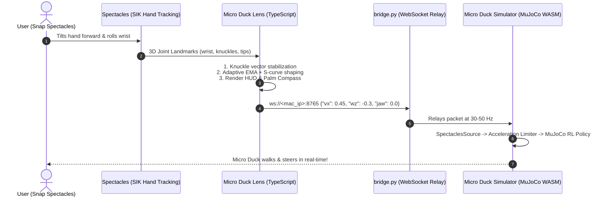

<div align="center">

# 🐤 specs-microduck
### Spatial AR Gesture Control & Teleoperation for Pollen Robotics Micro Duck via Snap Spectacles

[](https://opensource.org/licenses/MIT)
[](https://ar.snap.com/download)
[](https://developers.snap.com/spectacles)
[](https://github.com/google-deepmind/mujoco)
[]()

<p align="center">
  <b>Teleoperate the Pollen Robotics Micro Duck biped robot with natural hand gestures in Augmented Reality on Snap Spectacles.</b><br/>
  Featuring real-time 6DoF hand tracking, adaptive low-pass smoothing, live in-lens telemetry, and zero-dependency local relay.
</p>

</div>

---

## 🌟 Highlights

- 🖐️ **Intuitive Spatial Locomotion**: Tilt your palm forward/down to drive forward, tilt back to reverse, and roll your wrist to steer.
- 🐤 **Expressive Action Gestures**:
  - **Index Pinch**: Quacks and opens the beak proportionally in real-time.
  - **Middle Pinch**: Power soccer kick with the robot's leg.
  - **Ring Pinch**: 360° roll-over recovery & crouch-glide.
  - **Double Pinch**: Instant toggle between **Walking Legs** 🚶 and **Skating Rollers** 🛼.
- 📊 **In-Lens AR Telemetry & Compass**: Real-time HUD displaying speed, turn rate, live pitch/roll degree readouts (`[FORWARD 🏃]`, `[REVERSE 🔙]`, `[LEVEL ⏹️]`), ping latency, and a floating palm-attached steering vector rendered in the playful **Fredoka** typography.
- ⚡ **Ultra-Smooth Control**: Knuckle-anchored orientation vectors (eliminates pinch jitter), Schmitt trigger hysteresis, and continuous acceleration ramp limiting on the MuJoCo RL policy.
- 🔌 **Zero-Dependency Relay Bridge**: Lightweight Python WebSocket bridge syncing Spectacles and the browser simulator across local Wi-Fi with $<15$ ms latency.

---

## 📐 System Architecture



---

## 🎮 Spatial Gesture Control Matrix

| Gesture | Movement / Hand Pose | Robot Behavior | In-Lens HUD Feedback |
| :--- | :--- | :--- | :--- |
| **Drive Forward** | **Tilt Palm Forward / Down** ($>6^\circ$) | Smooth forward walking / rolling ($0 \to 0.5$ m/s) | `[FORWARD 🏃]` + Green Palm Arrow |
| **Reverse** | **Tilt Palm Back / Up** ($>6^\circ$) | Smooth reverse walking / rolling ($0 \to -0.25$ m/s) | `[REVERSE 🔙]` + Red Palm Arrow |
| **Steer Left / Right** | **Roll Wrist Sideways** ($>8^\circ$) | Turns left or right (up to $1.0$ rad/s) | `[LEFT ⬅️]` / `[RIGHT ➡️]` Direction Indicator |
| **Neutral / Stop** | **Hold Hand Level & Flat** | Smoothly decelerates to standing idle | `[LEVEL ⏹️]` (Zero Velocity) |
| **Quack & Beak** | **Index Pinch** (Thumb + Index) | Opens beak proportional to pinch + plays quack | `🐤 QUACK!` + Gold Fingertip Halo |
| **Soccer Kick** | **Middle Pinch** (Thumb + Middle) | Power kick with the right leg toward the ball | `⚽ KICK!` + Cyan Fingertip Halo |
| **Roll Recovery** | **Ring Pinch** (Thumb + Ring) | 360° roll-over recovery & crouch | `🔄 ROLL!` + Magenta Fingertip Halo |
| **Locomotion Mode** | **Double Pinch** (Index + Middle) | Switches between **Walking Legs** and **Rollers** | `🛼 MODE SWITCH [ROLLERS]` |
| **Sit / Stand** | **Fist / Push Palm Down** | Sits down on hull or stands back up | `🪑 SIT/STAND` |
| **Reset Simulation** | **Open Palm Wave** | Teleports duck & ball to center | `🔁 RESET SIM` |

---

## 📁 Repository Structure

```
specs-microduck/
├── Micro Duck Proto/                       # Complete Lens Studio 5.x Spectacles Project
│   ├── Assets/
│   │   ├── Fonts/                          # Playful typography for AR HUD
│   │   │   ├── Fredoka-Bold.ttf            # Primary rounded bubble font
│   │   │   ├── DynaPuff-Bold.ttf           # Secondary companion font
│   │   │   └── Sniglet-Bold.ttf
│   │   └── Scripts/
│   │       ├── MicroDuckBootstrap.ts       # Scene lifecycle & auto-wiring
│   │       ├── MicroDuckGestureController.ts# SIK hand tracker, filter & gesture parser
│   │       ├── MicroDuckHUD.ts             # Live AR HUD, telemetry & instructions
│   │       ├── MicroDuckSpecsClient.ts     # WebSocket network client (30-50 Hz)
│   │       └── MicroDuckVisualExperience.ts# 3D holographic duck avatar & reticle
│   ├── Packages/
│   │   ├── SpectaclesInteractionKit.lspkg  # SIK 0.16.4
│   │   └── SpectaclesUIKit.lspkg
│   └── Micro Duck Proto.esproj             # Main Lens Studio Project File
│
├── simulator-integration/                  # Drop-in integration for Micro Duck Simulator
│   ├── setup_simulator.py                  # Automated 1-command installer & patcher
│   └── spectacles.js                       # Spectacles input source for simulator
│
├── bridge.py                               # Zero-dependency Python WebSocket relay server
├── simulate_gestures.py                    # Headless CLI testing & demonstration tool
├── LICENSE                                 # MIT Open Source License
└── README.md                               # Project documentation (this file)
```

---

## 🚀 Quick Start Guide

### Prerequisites
- **Computer**: macOS, Linux, or Windows with Python 3.9+ and Node.js 18+.
- **Lens Studio**: [Lens Studio v5.15+](https://ar.snap.com/download) with Snap Spectacles developer mode enabled.
- **Network**: Computer and Spectacles connected to the **same local Wi-Fi network**.

---

### Step 1: Automated Simulator Setup
Run the automated installer script to clone the upstream Micro Duck simulator from Hugging Face and patch it with the Spectacles controller:

```bash
python3 simulator-integration/setup_simulator.py
```

> **What this does:**
> 1. Clones `https://huggingface.co/spaces/pollen-robotics/microduck-simulator` into `./microduck-simulator`.
> 2. Copies `spectacles.js` into the simulator's input controller system.
> 3. Registers `SpectaclesSource` in `game.js`.
> 4. Runs `npm install`.

*(Optional manual setup instructions can be found in [Manual Simulator Setup](#manual-simulator-setup).)*

---

### Step 2: Start the Bridge Server
In a terminal, start the local WebSocket relay server:

```bash
python3 bridge.py --port 8765
```

The bridge will display your computer's local Wi-Fi IP address (e.g. `192.168.29.46`):
```text
🐤 MICRO DUCK SPECTACLES WEBSOCKET BRIDGE SERVER
================================================================
  • Listening on: ws://0.0.0.0:8765
  • Local LAN IP: ws://192.168.29.46:8765
  • Spectacles setting: bridgeHost = '192.168.29.46', port = 8765
  • Simulator: Auto-connects to ws://192.168.29.46:8765
================================================================
```

---

### Step 3: Launch the Simulator Web App
In a second terminal, launch the web simulator:

```bash
cd microduck-simulator/app
npm run dev
```

Open **`http://localhost:5173`** in your browser. The simulator will automatically connect to `ws://192.168.29.46:8765` and listen for gesture packets!

---

### Step 4: Open & Deploy the Spectacles Lens
1. Open **Lens Studio 5.x**.
2. Open [`Micro Duck Proto/Micro Duck Proto.esproj`](Micro%20Duck%20Proto/Micro%20Duck%20Proto.esproj).
3. In the Inspector for `MicroDuckSpecsClient`:
   - Set `bridgeHost` to your computer's local Wi-Fi IP (e.g. `192.168.29.46`).
   - Set `bridgePort` to `8765`.
4. Click **Send to Spectacles** (or test inside Lens Studio Preview).
5. Put on your Spectacles, raise your hand, and enjoy driving your Micro Duck!

---

## 🧪 Testing Without Physical Hardware

You can verify the entire pipeline without wearing Spectacles using the built-in synthetic gesture streamer:

```bash
python3 simulate_gestures.py --port 8765
```

This executes a full automated routine (walking, curved turning, quacking, kicking, rolling, and switching to high-speed roller mode) directly in the web simulator.

---

## 🛠️ Telemetry & Network Protocol

### 1. Continuous Control Packet (`30-50 Hz`)
```json
{
  "type": "control",
  "vx": 0.42,
  "vy": 0.0,
  "wz": -0.25,
  "jaw": 0.85,
  "hand": "right",
  "gesture": "Driving",
  "timestamp": 1788021890123
}
```

### 2. Discrete Action Event
```json
{
  "type": "action",
  "action": "quack",
  "hand": "right",
  "gesture": "Index Pinch (Quack)",
  "timestamp": 1788021890456
}
```
*Supported actions:* `"quack"`, `"kickL"`, `"kickR"`, `"roll"`, `"sitToggle"`, `"locoToggle"`, `"reset"`.

---

## ⚙️ Inspector Customization Options

| Script | Property | Default | Description |
| :--- | :--- | :--- | :--- |
| `MicroDuckGestureController` | `drivingHandType` | `"right"` | Primary hand for steering (`"right"` or `"left"`) |
| `MicroDuckGestureController` | `pitchDeadzoneDeg` | `6.0` | Deadzone angle before forward/reverse initiates |
| `MicroDuckGestureController` | `invertPitch` | `false` | Invert forward/backward pitch direction |
| `MicroDuckGestureController` | `invertRotation` | `true` | Invert left/right turning roll direction |
| `MicroDuckGestureController` | `smoothingAlpha` | `0.28` | Velocity smoothing factor (`0.1` = crisp, `0.6` = damped) |
| `MicroDuckSpecsClient` | `bridgeHost` | `"192.168.29.46"`| IP of the computer running `bridge.py` |
| `MicroDuckSpecsClient` | `streamRateHz` | `30` | WebSocket transmission frequency |
| `MicroDuckHUD` | `showInstructions`| `true` | Show on-screen gesture control card |

---

## 📖 Manual Simulator Setup

If you prefer to configure the simulator manually instead of using `setup_simulator.py`:

1. Clone the simulator:
   ```bash
   git clone https://huggingface.co/spaces/pollen-robotics/microduck-simulator
   ```
2. Copy `simulator-integration/spectacles.js` to `microduck-simulator/app/src/game/controls/spectacles.js`.
3. In `microduck-simulator/app/src/game/game.js`, import and add `SpectaclesSource`:
   ```javascript
   import { SpectaclesSource } from "./controls/spectacles.js";
   
   // Inside initControls():
   const specsSource = new SpectaclesSource({ getVelocityLimits: () => model.getVelocityLimits() });
   controller = new Controller({ sources: [padSource, specsSource, touchSource, kbSource] });
   ```
4. Run `npm install && npm run dev` inside `microduck-simulator/app`.

---

## 📄 License & Credits

Created with ❤️ by **[Krunal](https://github.com/krazyykrunal)** (`krazyykrunal`).

Distributed under the **[MIT License](LICENSE)**.

### Acknowledgements
- **[Pollen Robotics](https://pollen-robotics.com)**: For creating the open-source Micro Duck robot and MuJoCo simulation environment.
- **[Snap Inc.](https://ar.snap.com/spectacles)**: For Snap Spectacles AR hardware and the Spectacles Interaction Kit (SIK).
- **Google Fonts**: [Fredoka](https://fonts.google.com/specimen/Fredoka) typography under SIL Open Font License.
