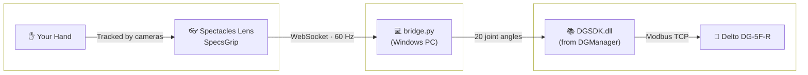
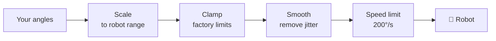
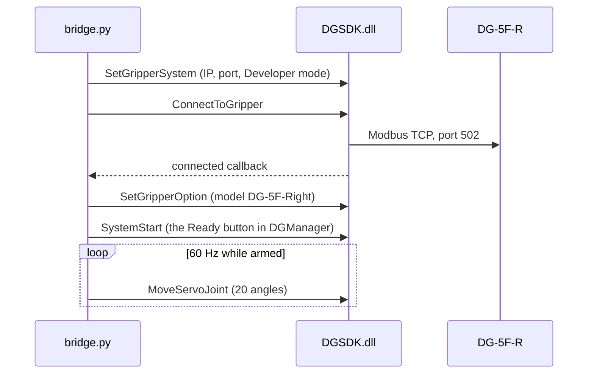

<h1 align="center">😎 SpecsGrip ✊</h1>

<p align="center">
  Control a <b>Tesollo Delto DG-5F robot hand</b> with your bare hands through <b>Snap Spectacles!</b><br>
  SpecsGrip reads every finger joint from Spectacles hand tracking and streams it to a small bridge on your PC, which drives all 20 joints of the robot hand in real time - no gloves, no controllers, just your hand.
</p>

<p align="center">
  <a href="#features">✨ Features</a> •
  <a href="#supported-devices">🦾 Hardware</a> •
  <a href="#setup">🚀 Setup & Guide</a> •
  <a href="#how-it-works">⚙️ How it works</a> •
  <a href="#troubleshooting">🛠️ Troubleshoot</a> •
  <a href="#structure">📁 Project Structure</a>
</p>


<!-- <p align="center">
  
</p> -->

https://github.com/user-attachments/assets/089905e0-afa3-4d06-90e4-105c6f981827

---

<a id="features"></a>
## ✨ Features

| Feature | Description |
| :--- | :--- |
| 🖐️ **Bare-hand teleoperation** | Your fingers drive the robot's fingers directly - curl, spread and thumb opposition across all 20 joints. |
| ⚡ **Real time** | Hand data streams at 60 Hz into the gripper's real-time servo command, so the robot follows as you move. |
| 🔀 **Either hand** | Drive the right-handed robot with your right hand, or your left - left-hand input is mirrored automatically. Auto-switch follows whichever hand is in view. |
| 🛡️ **Safety first** | Starts disarmed, clamps every joint to factory-proven limits, caps joint speed, and freezes in place if the signal drops. |
| 🤖 **On-lens debug panel** | A colour-coded status readout inside the Lens: connection state, packets sent, tracking, and the last error - so you're never debugging blind on the glasses. |
| 🎛️ **Tune without rebuilding** | All scaling, limits and smoothing live in one `config.json` on the PC. Edit, restart the bridge in 2 seconds - no Lens rebuild or re-push. |
| 📦 **Zero dependencies** | The bridge is plain Python standard library. No `pip install`. |

---

<a id="supported-devices"></a>
## 🦾 Supported Hardware

| Device | Type | Status | Notes |
| :--- | :--- | :--- | :--- |
| **Spectacles (2024)** | Glasses | ✅ Supported | Camera-based hand tracking: keep your hand in view and in reasonable light. |
| **Specs (2026)** | Glasses | ⚠️ Need to test | — |
| **Delto DG-5F-R** (right) | Robot hand | ✅ Supported (DGSDK 2.0.0, firmware 769) | The reference hardware. |
| **Delto DG-5F-L** (left) | Robot hand | ⚠️ Need to test | Set `model` to `24338` (`0x5F12`) in `config.json`; abduction limits likely need mirroring. |
| **Delto DG-5F-S variants** | Robot hand | ⚠️ Need to test | — |
| **Windows PC** | Bridge host | ✅ Supported (tested on Windows 11) | Needs Tesollo **DGManager** installed - the bridge drives its `DGSDK.dll`. |
| **macOS / Linux** | Bridge host | ❌ Not supported yet | Tesollo ships a Linux `.so`, but the bridge currently loads the Windows DLL and uses Windows-only APIs. |

---

<a id="setup"></a>
## 🚀 Setup & Guide

<details open>
<summary><b>🦾 Full Setup (Spectacles + Robot Hand)</b></summary>
<br>

**What you need**

| | |
| :--- | :--- |
| 🦾 **Delto DG-5F-R** | Connected to your PC by Ethernet |
| 💻 **Windows PC** | With Tesollo **DGManager** installed (the bridge uses the `DGSDK.dll` that ships inside it) |
| 🐍 **Python 3** | Tested on 3.13. Standard library only |
| 👓 **Spectacles (2024)** | Plus Lens Studio 5.15+ to push the Lens |
| 📶 **One shared network** | For the PC and the Spectacles - make sure it's a private Wi-Fi network |

1. **Connect the robot hand:**
   - **1.1** Plug the DG-5F-R into your PC by Ethernet and connect once in **DGManager** to confirm it works. The defaults are TCP `169.254.186.72`, port `502`, model **Delto Gripper-5F-Right**, in **Developer** mode. If yours differ, update the `gripper` section of `bridge/config.json` to match.
   - **1.2** **Close DGManager.** The gripper only accepts one client at a time, and DGManager holds the connection while it's open.
   - **1.3** Sanity-check the connection. This never engages the servos, so the hand can't move:
     ```bash
     cd path\to\SpecsGrip\bridge
     py connecttest.py
     ```
     You should see `SEQUENCE OK` and the hand's live joint angles.

2. **Put the PC and Spectacles on the same network:**
   - **2.1** Join **both** the PC and the Spectacles to the same Wi-Fi. Make sure you use a **private Wi-Fi** network - public and guest Wi-Fi often block devices from talking to each other, and nothing on your PC can fix that.
   - **2.2** When Windows asks *"Allow your PC to be discoverable on this network?"*, choose **Yes**. That marks the network **Private**. (Only do this on a network you own, like your home Wi-Fi.)
   - **2.3** In an **admin** PowerShell, allow the bridge through the firewall (one time):
     ```powershell
     New-NetFirewallRule -DisplayName "Delto Hand Bridge" -Direction Inbound -Protocol TCP -LocalPort 8765 -Action Allow -Profile Private
     ```
   - **2.4** Run the network preflight. It prints the exact URL the Lens needs and flags anything that will block it:
     ```bash
     py netcheck.py
     ```

3. **Start the bridge:**
   ```bash
   py bridge.py
   ```
   Wait for `gripper ready`. The bridge starts **DISARMED** - nothing moves until you arm it:

   | Key | Action |
   | :--- | :--- |
   | **`space`** | Arm / disarm |
   | **`n`** | Slowly return the hand to neutral |
   | **`q`** | Quit (returns to neutral, then disconnects cleanly) |

4. **Launch the SpecsGrip Lens:**
   - **4.1** Open `SpecsGrip.esproj` in Lens Studio.
   - **4.2** Select the **HandBridge** object and paste the URL from `netcheck.py` into **Server Url**.
     > ⚠️ The saved value is the author's home network address and won't work for you. You can enter several URLs separated by commas - the Lens tries each in turn, which saves re-pushing when your PC gets a new IP.
   - **4.3** Push the Lens to your Spectacles. You can close Lens Studio and unplug afterwards - the Lens runs on its own.
   - **4.4** Launch it and wait for **`CONNECTED`** in green on the **Debug Panel** (it's on by default). Hold your hand up, press **`space`** on the PC to arm, and the robot hand follows you.

   > 💡 The Lens can't connect from Lens Studio's **Preview** - Spectacles only allows its network connections on the device itself. Always test on the glasses.

5. **SpecsGrip Lens:**

This is the Settings panel found inside the SpecsGrip Lens.


- **Hand Track ✋ (Left / Right)**: Chooses which of your hands drives the robot. **Right** by default, which maps straight across to the right-handed DG-5F-R. **Left** works too - it's mirrored automatically so the robot moves the same way.
- **Hand Track Auto Switch 🙌**: Follows whichever hand is in view. It only hands over when the current hand leaves view, so the robot doesn't jitter when both hands flicker in and out. **Off** by default - turn it back off and the robot returns to the hand chosen in **Hand Track ✋**.
- **Debug Panel 🤖**: Shows or hides the connection readout - state, server URL, packets sent, which hand is tracked, and the last error. Green means streaming, amber means connected but no hand in view, red means not connected. **On** by default - keep it on while you set up.
- **Instructions 🤝**: Shows or hides a quick setup checklist - the robot hand is powered on, **Server Url** has your PC's address, and the PC and Spectacles are on the same network - plus a link back to this repo. **Off** by default.


</details>

##

<details close>
<summary><b>🧪 Testing without Spectacles (For Developers)</b></summary>
<br>
You can exercise the whole pipeline - networking, retargeting and safety - without the glasses, and even without the robot.

1. **Pipeline only, robot untouched.** `--dry-run` never opens a connection to the gripper; it prints what it *would* send:
   ```bash
   py bridge.py --dry-run --auto-arm
   ```
2. In a **second terminal**, feed it synthetic hand poses:
   ```bash
   py test_sender.py --wave
   ```
3. **Check the joint mapping on the real robot.** With `py bridge.py` running and armed, `--sweep` moves **one joint at a time** and prints its name. Watch the hand and confirm each joint is the one named - the fastest way to catch a joint moving the wrong way:
   ```bash
   py test_sender.py --sweep
   ```
4. **Check the SDK bindings** (read-only, no connection):
   ```bash
   py selftest.py
   ```

Tuning lives in [`bridge/config.json`](bridge/config.json). See [`bridge/README.md`](bridge/README.md) for the full reference.
</details>

---

<a id="how-it-works"></a>
## ⚙️ How it works

<!-- TODO: add a how-it-works video, e.g.
<video src="https://github.com/user-attachments/assets/..." width="300" controls></video>
-->

##
<details open>
<summary><b>📐 System Architecture</b></summary>
<br>



</details>

##

<details open>
<summary><b>📖 Technical Deep Dive</b></summary>
<br>

**1. Spectacles measures your hand:** <br>

Spectacles hand tracking gives the Lens 21 points on your hand: the wrist, plus every knuckle and fingertip. From those, `HandBridge.ts` builds a small coordinate frame anchored to your palm, then reads each finger against it:

- 🦴 **Curl** - the angle between each pair of neighbouring finger bones.
- ↔️ **Spread** - how far each finger swings sideways, measured flat across the palm.
- 👍 **Thumb opposition** - how far the thumb swings across the palm towards the fingers.

> 💡 A left hand is a mirror image of a right hand, so its palm frame comes out flipped - uncorrected, spread and thumb opposition would drive **backwards** while curl looked perfectly fine. The Lens flips the frame for a left hand, so either hand moves the robot the same way.
##

**2. The Lens streams raw angles to your PC:** <br>

60 times a second, the Lens sends 20 angles - 4 per finger - as a small JSON message over a WebSocket:

```json
{
  "t": 12345,
  "tracked": true,
  "hand": "right",
  "f": [[5, 40, 12, 30], [-3, 60, 75, 40], [0, 65, 80, 45], [2, 60, 78, 40], [4, 55, 70, 35]]
}
```

`f` holds 5 fingers (thumb → pinky), each with 4 angles in degrees.

The Lens is deliberately "dumb": it only measures. Every decision about **how** your hand maps onto the robot lives on the PC, which is why you can retune everything without rebuilding the Lens.
##

**3. The bridge maps your hand onto the robot:** <br>

The DG-5F has 20 joints - 4 per finger, positive = curl:

| Finger | Joint 1 | Joint 2 | Joint 3 | Joint 4 |
| :--- | :--- | :--- | :--- | :--- |
| **Thumb** (0-3) | Spread | Opposition | Base curl | Tip curl |
| **Index** (4-7) | Spread | Base curl | Middle curl | Tip curl |
| **Middle** (8-11) | Spread | Base curl | Middle curl | Tip curl |
| **Ring** (12-15) | Spread | Base curl | Middle curl | Tip curl |
| **Pinky** (16-19) | Spread | Base curl | Middle curl | Tip curl |

Each of your angles is scaled into that joint's range. The limits aren't guesses: they're the minimum and maximum of the **100 factory poses** Tesollo ships for the DG-5F-R, so every limit is one the hand is known to reach.

> 💡 A relaxed, flat hand always maps to the robot's neutral pose. The bridge checks this every time it starts and warns if a config edit breaks it - it's what makes "open your hand" a predictable, safe resting position.
##

**4. Every command passes through a safety pipeline:** <br>



The order matters: clamping **before** smoothing means a glitchy reading can never drag the hand outside its safe range, and the speed limit runs **last**, so it has the final say on how fast any joint moves. On top of that:

- 🔒 The bridge starts **disarmed** - nothing moves until you press `space`.
- 🧊 If packets stop for 300 ms or your hand leaves view, the robot **freezes in place** - it doesn't go limp or snap back.
- 👋 Quitting slowly returns the hand to neutral before disconnecting.
##

**5. The bridge talks to the gripper through Tesollo's own SDK:** <br>

Rather than reverse-engineering the gripper's protocol, the bridge drives `DGSDK.dll` - the same library DGManager itself uses - directly from Python:



> 💡 The order is strict. The gripper's model can only be confirmed once the connection is live, so setting options **before** connecting fails with `NOT_FOUND_MODEL`. DGManager avoids this by applying them from inside its "connected" callback - the bridge does the same. `MoveServoJoint` is the real-time command that makes live teleoperation possible, and it's only available in **Developer** mode.

</details>

---

<a id="troubleshooting"></a>
## 🛠️ Troubleshooting Guide

| Symptom | Things to try |
| :--- | :--- |
| 🧊 **Robot hand doesn't move** | The bridge starts **disarmed** - press `space`. Also check you didn't run with `--dry-run`, and that something is sending poses (the Lens or `test_sender.py`). The bridge's status line says which it is. |
| 📂 **`can't open file ... bridge.py`** | Your terminal isn't in the `bridge` folder. `cd path\to\SpecsGrip\bridge` first, in every new terminal. |
| 🔌 **`ConnectToGripper failed: SOCK_EXCEPTION`** | DGManager is still open - the gripper only takes one client at a time. Close it and retry. |
| ❓ **`SetGripperOption failed: NOT_FOUND_MODEL`** | The connection to the gripper never came up. Check the Ethernet cable, then run `py connecttest.py` to see which step fails. |
| 📵 **Debug Panel shows `CLOSED` (code 1006 or 1011)** | The Lens never reached your PC. Most often your PC's IP changed - run `py netcheck.py` and update **Server Url**. Also check the Spectacles are on the **same** network, and the firewall rule is in place. |
| 🙈 **Won't connect in Lens Studio Preview** | Expected! The Lens can only connect from the Spectacles themselves. Push it to the glasses. |
| 📶 **On public / guest Wi-Fi** | These networks often stop devices from seeing each other. Use a private Wi-Fi network instead. |
| 👻 **Lens says `CONNECTED` but the robot ignores it** | An old bridge may still be running. Check with `Get-NetTCPConnection -LocalPort 8765 -State Listen` and stop it. (The bridge now refuses to start a second copy.) |
| 🔄 **A finger moves the wrong way** | Run `py test_sender.py --sweep` to find which joint, then swap that joint's two `out` values in `bridge/config.json`. |
| 〰️ **Jittery movement** | Lower `smoothing_alpha` in `config.json` for smoother (slightly laggier) motion. |
| 💥 **Movement feels too snappy** | Lower `max_deg_per_sec` in `config.json`. |
| 🟡 **Debug Panel is amber** | Connected, but no hand in view. Hold your hand where the Spectacles can see it. |

---

<a id="structure"></a>
## 📁 Project Structure

The repo has two halves: a **Lens Studio project** (everything the Spectacles run) and the
**bridge** folder (the Python program on your PC that drives the robot hand).

```
SpecsGrip/
├── SpecsGrip.esproj            # Lens Studio project file (open this in Lens Studio)
├── Assets/
│   ├── Scene.scene             # the Lens scene (HandBridge, settings, debug and instructions panels)
│   ├── Scripts/
│   │   └── HandBridge.ts       # the core Lens script (see table below)
│   ├── SettingsPanel_Frame.lspkg   # the in-Lens settings panel, plus ToggleSetActive.ts
│   └── SpectaclesUIKit.lspkg       # Snap's UI widgets (switches, frames)
├── Packages/
│   └── SpectaclesInteractionKit.lspkg   # Snap's interaction framework (hand tracking)
└── bridge/
    ├── bridge.py               # the bridge - run this on your PC
    ├── config.json             # all tuning: ranges, limits, smoothing, safety
    ├── ...                     # helpers and tests (see table below)
    └── README.md               # bridge reference: tuning, debug states, firewall details
```

**`Assets/` - the Lens logic**

| Script | What it does |
| :--- | :--- |
| 🖐️ `HandBridge.ts` | The core. Reads your hand from Spectacles hand tracking, measures all 20 angles, and streams them to the bridge. Also handles reconnecting (cycling through multiple server URLs), left-hand mirroring, auto hand switching, the Debug Panel readout, and the settings panel's Hand Track and Hand Track Auto Switch switches (through its public `toggleHandToTrack` and `toggleAutoSwitchHand` functions). |
| 🎚️ `ToggleSetActive.ts` | Generic helper in `SettingsPanel_Frame.lspkg/Scripts/` - wire a UI switch to it to show or hide any object. Powers the Debug Panel and Instructions switches, and highlights Left or Right on the Hand Track switch. |

**`bridge/` - the PC side**

| File | What it does |
| :--- | :--- |
| 🧠 `bridge.py` | The main program. Receives hand data, runs the safety pipeline, and commands the robot at 60 Hz. Handles arming, the signal-loss freeze, and a clean shutdown. |
| 🔗 `dg5f.py` | Connects Python to Tesollo's `DGSDK.dll`, in the same order DGManager uses. |
| 📐 `retarget.py` | Maps your hand onto the robot: scaling, clamping, smoothing and the speed limit. |
| 🌐 `wsserver.py` | A tiny WebSocket server the Lens connects to - built on the standard library, so nothing to install. |
| ⚙️ `config.json` | Every tunable value in one place. |
| 🧪 `test_sender.py` | Fake hand poses for testing without Spectacles: `--wave`, `--sweep` (one joint at a time) and `--hold`. |
| 📡 `netcheck.py` | Network preflight - prints the URL for the Lens and flags firewall or network problems. |
| 🩺 `connecttest.py` | Checks the gripper connection and reads its live state, without ever moving it. |
| 🔍 `selftest.py` | Checks the SDK loads correctly - no connection, no movement. |

<a id="license"></a>
## 📄 License & Credits

<i>Distributed under <a href="LICENSE">MIT License</a> - contributions, forks and stars welcome.</i> 🤝<br>

Created by <a href="https://github.com/amirmohideen">Amir Mohideen Basheer Khan</a> <br>

📁 [<a href="https://github.com/amirmohideen">Source Repo</a>](https://github.com/amirmohideen/SpecsGrip)

