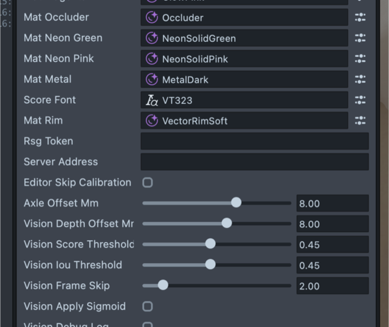

# The 5.23 Lens (`lens-523/`)

The same air-hockey Lens as [`lens/`](LENS.md), carried forward to **Lens Studio
5.23** and the current SPECS platform. `lens/` stays exactly where it is — it is
the version proven on Spectacles (2024), and nothing here changes it.

Two folders instead of one because a Lens Studio project can only move forward:
once 5.23 upgrades a project it will not open in 5.15 again. Keeping the 5.15
project untouched is what lets the Spectacles (2024) build stay playable while
the newer one moves.

| | `lens/` | `lens-523/` |
|---|---|---|
| Lens Studio | 5.15.4 | 5.23.0 |
| Target | Spectacles (2024) | current SPECS |
| Detector | `best.onnx` | `best.onnx` (+ a quantised export, unused) |
| Hardware-tested | yes | yes |

Everything else — the server, the protocol, the wizard, the gameplay — is
shared, so one server plays with either. The 5.23 Lens dials the same
`ws://vectar.local:8777`, with one caveat that costs a first-run debugging
session if you do not know it: newer Specs do not resolve `.local`, so it also
needs a plain address (see below).

## What the migration actually changed

The Lens code needed **no API migration**. A scan for every deprecated
Spectacles (2024) API — `RemoteServiceModule`, the `loadAs*` remote-media
calls, `StereoCameraModule`, the depth-texture providers, `VoiceMLModule`,
`LeaderboardModule`, SyncKit's old `StorageProperty` generics — came back
empty. This Lens was already on `InternetModule` and the unified
`CameraModule`, which is what SPECS 27 wants.

What did change, all of it done by Lens Studio during the upgrade:

- **Packages moved to 2.0.0** — SpectaclesInteractionKit (0.17.2 → 2.0.0, SIK
  runtime 0.18.0), SpectaclesUIKit (0.1.5 → 2.0.0), SurfacePlacement (0.5.0 →
  2.0.0), Spectacles3DHandHints (1.2.0 → 2.0.0); SnapDecorators, Utilities and
  RemoteServiceGateway came across as 2.0.0 with the project upgrade. Our
  imports (`Interactable`, `SIK`, `WorldCameraFinderProvider`, `OneEuroFilter`,
  `NativeLogger`, `Event`) survived the major-version bump unchanged.
- **Shaders converted** — all eleven `.ss_graph` graphs became `.graphShader`,
  the 5.23 format. One-for-one, done by the editor.
- **Packages are archives now**, not unpacked folders, so the project tree is
  much smaller than the 5.15 one for the same content.

## The quantised detector

`Assets/ML/vector_yolo_qnn.dlc` is a quantised export of the same YOLO
detector as `best.onnx`. Both have identical shapes — 512×512×3 in, three
heads of 64/32/16 × 18 out — so `CoffeeDetector` decodes either one without
knowing which it got.

Their **input normalisation must match too**, and that is easy to miss: the
importer defaults a fresh model to `scale = 1.0`, while this detector was
trained on pixels scaled to 0..1, which is what `best.onnx` carries
(`scale = 0.0039`, i.e. 1/255). A model fed 0..255 does not fail loudly — it
just detects nothing, or detects nonsense. Both assets now carry 0.0039 on all
three channels; if you ever re-import the `.dlc`, check that field first.

Both are shipped, but — measured on hardware — **the float export is what
actually runs, in both places**: this Lens does not load the quantised one.

`CoffeeMLController` still picks between them — on-device it prefers
`modelQuantized` when one is wired, and falls back to `model` when it does not
load, which is what happens today. Wiring is already done in the shipped scene
(GameController → `mlModel` = `best`, `mlModelQuantized` = `vector_yolo_qnn`).
Unwire `mlModelQuantized` to skip the failed attempt entirely; unwire both and
the game still plays on odometry alone.

## What newer Specs do differently

Three things behave differently from Spectacles (2024), all found on the first
device run and all now handled in code. Worth knowing, because each one fails
in a way that does not name itself.

**There is no left colour camera.** Asking for `Left_Color` throws out of
`onStart`, which kills the vision controller before anything else runs — the
Lens looks like it crashed for no reason. It now tries candidates in order and
keeps the first the device grants; on this hardware that is `Right_Color`, the
same one the Phone Defense project uses. A grayscale fallback is announced in
the log, since the detector was trained on colour.

**`.local` names do not resolve.** The Lens dials `ws://vectar.local:8777`,
which worked on Spectacles (2024) and works in the editor preview — on newer
Specs it silently never connects, and the Lens sits in `CONNECT_WS` with
nothing in the log to explain it, because from its side nothing failed.

The fix takes ten seconds and no code:

1. Open the server console — **http://localhost:8780**
2. Copy the line shown as **Lens WS_URL** (it is the Mac's current address)
3. In Lens Studio select **GameController** in the Scene Hierarchy and paste it
   into the **Server Address** field in the Inspector

*GameController's Inspector — `Server Address` sits just under `Rsg Token`.
Empty means "use the name".*

Either form works — `ws://192.0.2.10:8777` or just `192.0.2.10`. Leave it blank
if your headset resolves the name; the Lens tries the name first either way and
keeps whichever answers. **Re-copy it whenever the Mac joins a different Wi-Fi**
— that address changes with the network, and it is the Mac's address that
matters, not the robot's or the glasses'.

**The quantised model does not load here.** On device the attempt fails and
the Lens falls back to the float ONNX, exactly what the preview runs. The
`.dlc` ships anyway — it is the same detector, and it costs nothing to keep.

## Honest status

**Run on SPECS hardware, and it plays.** The Lens boots on the glasses,
calibrates the surface, connects to the server and drives the robot. Getting
there took three device-only fixes, listed above — none of them reachable in
the editor, where the camera, the name resolution and the model all behave
differently.

What is confirmed: the migration itself (packages, shaders, scene), the
protocol, hand calibration, and the game loop against a real robot. What is
not: the quantised export — it does not load here, so vision uses the float
model on device too.

## Pause the preview before you test on the glasses

The server talks to **one** Lens at a time. Leave the Lens Studio preview
running while the glasses are on, and the two take turns kicking each other
off: the log fills with `Lens connected` / `Lens hello` every second, from two
different addresses, and neither session lasts long enough to play. Nothing
reports an error, because from each side it looks like a reconnect.

So pause (or close) the preview panel in Lens Studio before sending to the
glasses. In the console you can tell them apart by address — the Mac and the
headset each show their own.

## Setup

Same as [docs/LENS.md](LENS.md), with two differences: open
`lens-523/robo-hockey-523.esproj` in **Lens Studio 5.23**, and set the Preview
panel device to **SPECS 27**. Experimental APIs still need enabling — the Lens
speaks plain `ws://`, which keeps it a dev lens rather than a store one. The
voice agent and its Remote Service Gateway token work exactly as described
there.
